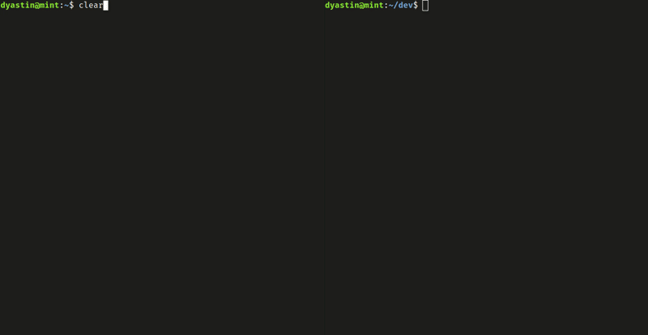

## gobyte

A local area network file sharing CLI app. 

### Demo



### Features

- Automatic peer discovery
- Multi-peer selection
- Multi-file selection
- File tree navigation
- Encrypted TCP connection (TOFU)

### Installation

```
go install github.com/Dyastin-0/gobyte@latest
```

### Basic Usage

#### Sender

Set the `-d` or `-dir` flag to the initial directory you want to start on when selecting files (default `~`).

```
gobyte chuck -d ~/Documents
```

#### Receiver

Set the `-d` or `-dir` flag to the directory you want to receive files to (default `~/gobyte/received`).

```
gobyte chomp -d ~/Documents/gobyte/received
```

### TODO

- Fix tls fingerprint calculation
